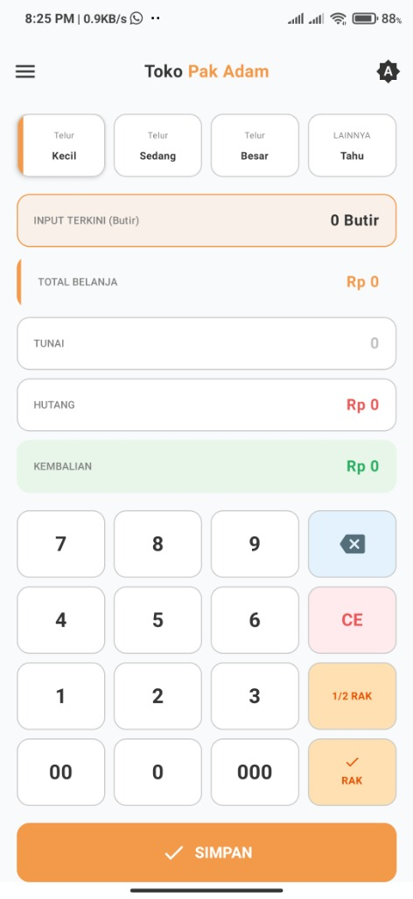
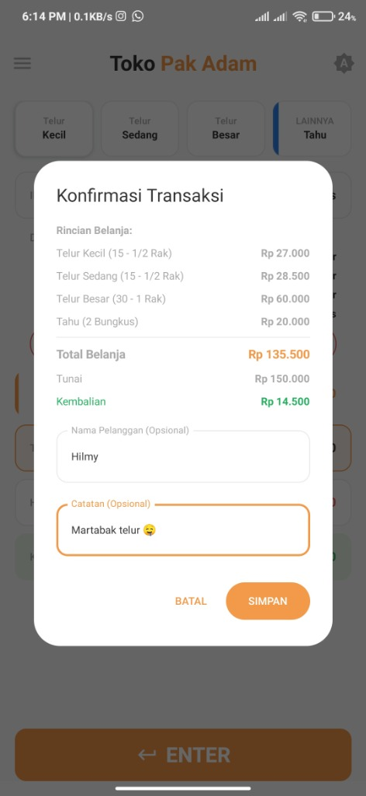
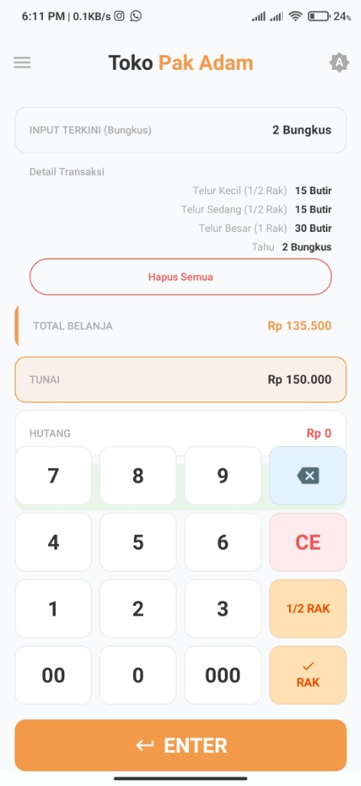
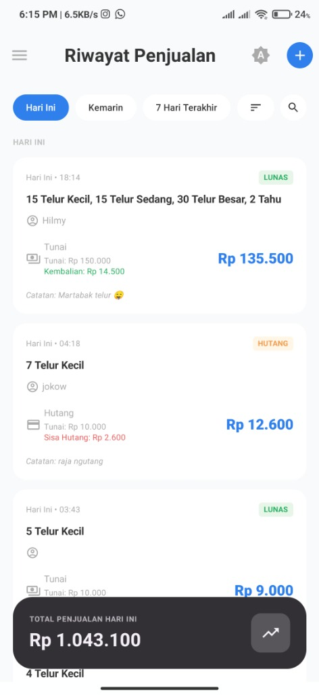
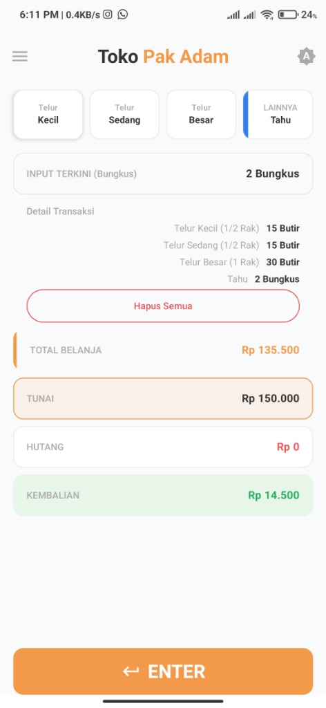
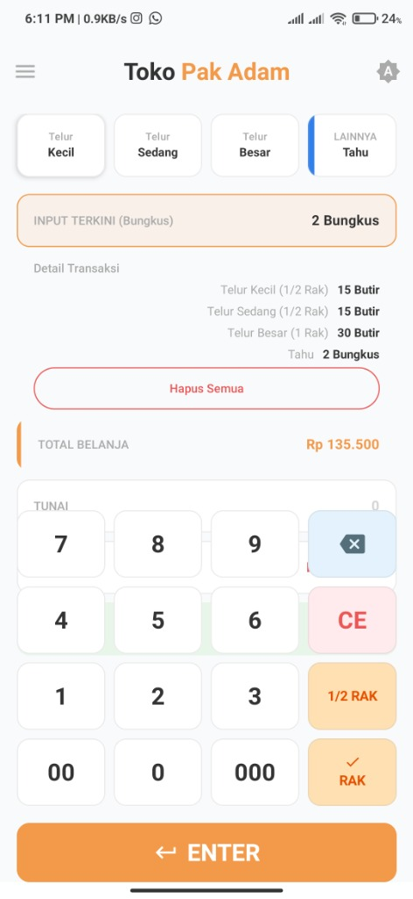

# Toko Pak Adam

Aplikasi manajemen transaksi toko yang modern dan efisien, dibangun dengan teknologi terbaru Android.

| POS / Home | Riwayat Transaksi | Konfirmasi Transaksi |
|:---:|:---:|:---:|
|  |  |  |
|  |  |  |

## 📋 Fitur Utama

- **Point of Sales (POS) Sederhana**: Input transaksi cepat dengan kalkulator khusus (Rak/Butir).
- **Manajemen Produk**: Mendukung penjualan Telur (Kecil, Sedang, Besar) dan Tahu.
- **Konversi Otomatis**: Menghitung jumlah rak dan butir secara otomatis.
- **Riwayat Transaksi**: Melihat daftar transaksi harian, kemarin, dan 7 hari terakhir.
- **Pencarian Canggih**: Cari transaksi berdasarkan catatan atau detail lainnya.
- **Tema Retro Modern**: Tampilan antarmuka yang menarik dengan dukungan Dark Mode.
- **Manajemen Hutang**: Mencatat dan memantau status pembayaran (Lunas/Hutang).

## 🛠️ Teknologi yang Digunakan

Project ini dibangun menggunakan:

- **Language**: [Kotlin](https://kotlinlang.org/)
- **UI Framework**: [Jetpack Compose](https://developer.android.com/jetbrains/compose) - Toolkit UI modern untuk Android.
- **Material Design 3**: Implementasi desain terbaru dari Google.
- **Architecture**: MVVM (Model-View-ViewModel).
- **Dependency Injection**: [Koin](https://insert-koin.io/) - Framework DI yang ringan untuk Kotlin.
- **Local Database**: [Room](https://developer.android.com/training/data-storage/room) - Library persistensi data yang kuat.
- **Navigation**: Navigation Compose.
- **DataStore**: Penyimpanan preferensi pengguna (seperti tema).

## 🚀 Cara Menjalankan

1. Clone repository ini.
2. Buka project di Android Studio (Koala atau lebih baru disarankan).
3. Biarkan Gradle melakukan sync.
4. Run aplikasi pada Emulator atau Device fisik (Min SDK 24).

## 📱 Struktur Project

- `presentation`: Berisi UI (Screen, Component, ViewModel)
- `domain`: Use Cases dan Repository Interface (jika ada pemisahan clean architecture)
- `data`: Implementasi Database, DAO, dan Repository.
- `di`: Konfigurasi Koin Modules.

---
Demi Toko Pak Adam 🔥.